# K-Flix DevOps Pipeline

A production-grade CI/CD pipeline for the K-Flix movie streaming app, built as a portfolio project demonstrating end-to-end DevOps practices on AWS.

[](https://github.com/kchimbodza/k-flix-react-app/actions)

---

## Architecture Overview

```
Developer Push
      │
      ▼
┌─────────────────────────────────────────────────────┐
│                  GitHub Actions (CI)                 │
│  npm build → Vitest → SonarCloud → Docker → Trivy  │
│                    → Push to ECR                    │
└─────────────────────────┬───────────────────────────┘
                          │ image tag updated in k8s/
                          ▼
┌─────────────────────────────────────────────────────┐
│                    ArgoCD (CD)                       │
│         Watches repo → Syncs to EKS cluster         │
└─────────────────────────┬───────────────────────────┘
                          │
                          ▼
┌─────────────────────────────────────────────────────┐
│                  AWS EKS Cluster                     │
│   k-flix namespace: nginx + json-server containers  │
│   monitoring namespace: Prometheus + Grafana +      │
│                         Alertmanager                │
└─────────────────────────┬───────────────────────────┘
                          │ alerts
                          ▼
                   Slack #k-flix-alerts
```

---

## Tech Stack

| Category | Tool | Purpose |
|---|---|---|
| Frontend | React 19, Vite, Tailwind CSS v4 | App framework |
| Testing | Vitest | Unit tests |
| Code Quality | SonarCloud | Quality gate, bug detection |
| Security | Trivy | Container vulnerability scanning |
| Containers | Docker, AWS ECR | Image build and registry |
| IaC | Terraform | EKS cluster, VPC, node groups |
| CI | GitHub Actions | Build, test, scan, push |
| CD / GitOps | ArgoCD | Automated deploy to Kubernetes |
| Orchestration | AWS EKS (Kubernetes) | Container orchestration |
| Monitoring | Prometheus, Grafana | Metrics collection and dashboards |
| Alerting | Alertmanager, Slack | Real-time incident notifications |

---

## Pipeline Stages

### 1. Build
```yaml
- name: Install dependencies
  run: npm ci
- name: Build
  run: npm run build
```
Vite compiles the React app into a production bundle. Fails fast if there are import errors or build-time type issues.

### 2. Test
```yaml
- name: Run tests
  run: npm run test
```
Vitest runs the unit test suite. Pipeline halts if any test fails — nothing broken ships downstream.

### 3. Code Quality
```yaml
- name: SonarCloud Scan
  uses: SonarSource/sonarcloud-github-action@master
```
SonarCloud analyzes for bugs, code smells, security hotspots, and duplications. Quality gate must pass before the Docker build step.

### 4. Docker Build
```yaml
- name: Build Docker image
  run: docker build -t $ECR_REGISTRY/$ECR_REPOSITORY:$IMAGE_TAG .
```
Multi-stage Dockerfile: Node build stage compiles the app, Nginx stage serves the static output.

### 5. Security Scan
```yaml
- name: Run Trivy scanner
  uses: aquasecurity/trivy-action@0.28.0
  with:
    severity: 'CRITICAL,HIGH'
    exit-code: '1'
```
Trivy scans the built image for known CVEs. Pinned to a specific version to protect against supply chain attacks. Fails the pipeline on CRITICAL or HIGH vulnerabilities.

### 6. Push to ECR
```yaml
- name: Push to ECR
  run: docker push $ECR_REGISTRY/$ECR_REPOSITORY:$IMAGE_TAG
```
Image is tagged with the git commit SHA for full traceability.

### 7. GitOps Deploy via ArgoCD
ArgoCD monitors the `k8s/` directory in this repository. When the image tag in `k8s/deployment.yaml` is updated by the pipeline, ArgoCD detects the change and automatically syncs the cluster — no manual `kubectl apply` needed.

ArgoCD features enabled:
- **Automated sync** — deploys on every change
- **Self-heal** — reverts manual cluster changes to match Git
- **Prune** — removes resources deleted from Git

### 8. Monitoring
Prometheus scrapes cluster metrics every 30 seconds. Grafana dashboard (ID: 15760) visualizes pod CPU, memory, and node health. Alertmanager routes alerts to Slack.

---

## Repository Structure

```
k-flix-react-app/
├── .github/
│   └── workflows/
│       └── ci.yml              # Full CI/CD pipeline
├── k8s/
│   ├── deployment.yaml         # K-Flix app deployment (ArgoCD watches this)
│   └── service.yaml            # LoadBalancer service
├── terraform/
│   ├── main.tf                 # EKS cluster
│   ├── vpc.tf                  # VPC, subnets, routing
│   ├── variables.tf            # Input variables
│   └── outputs.tf              # Cluster endpoint, ECR URL
├── src/                        # React app source
├── Dockerfile                  # Multi-stage build
├── deploy.sh                   # Full restore script
├── destroy.sh                  # Full teardown script
├── RUNBOOK.md                  # Operational runbook
└── CHALLENGES.md               # Issues encountered + fixes
```

---

## Infrastructure

**EKS Cluster:** `k-flix-cluster` in `us-east-2`  
**Node group:** 2x `t3.medium` (supports up to 17 pods each)  
**VPC:** Custom VPC with public/private subnets across 2 AZs  
**ECR:** `<AWS_ACCOUNT_ID>.dkr.ecr.us-east-2.amazonaws.com/k-flix`

> The cluster is torn down after every demo session and rebuilt on demand using `deploy.sh` to minimize AWS costs (~$0.28/hr while running).

---

## Quick Start

### Restore the full stack
```bash
./deploy.sh
```

### Tear down everything
```bash
./destroy.sh
```

### Open the UIs
```bash
# ArgoCD
kubectl port-forward svc/argocd-server -n argocd 8080:443
# Visit https://localhost:8080

# Grafana
kubectl port-forward svc/kube-prometheus-stack-grafana -n monitoring 3000:80
# Visit http://localhost:3000 — admin / kflix-admin123
```

---

## Key Decisions

**Why ArgoCD over kubectl in GitHub Actions?**  
ArgoCD uses a pull-based GitOps model — the cluster pulls from Git rather than having the CI pipeline push to it. This means cluster credentials never leave the cluster, which is more secure than storing a kubeconfig in GitHub Secrets.

**Why SonarCloud over SonarQube?**  
SonarQube requires a running server (added infrastructure cost and maintenance). SonarCloud is the SaaS equivalent — free for public repos, zero infrastructure, plugs directly into GitHub Actions with one step.

**Why Trivy over Snyk or Grype?**  
Trivy has a native GitHub Action, scans both OS packages and app dependencies in the same pass, and is free with no rate limits for open-source use. Version-pinned to protect against supply chain attacks.

**Why t3.medium nodes?**  
t3.micro supports a maximum of 4 pods due to AWS ENI limits. The full monitoring stack (Prometheus, Grafana, Alertmanager, kube-state-metrics, node-exporter) plus ArgoCD and K-Flix requires 10+ pods. t3.medium supports 17 pods and provides sufficient memory for the monitoring stack.

---

## Screenshots

### CI Pipeline — GitHub Actions All Stages Green
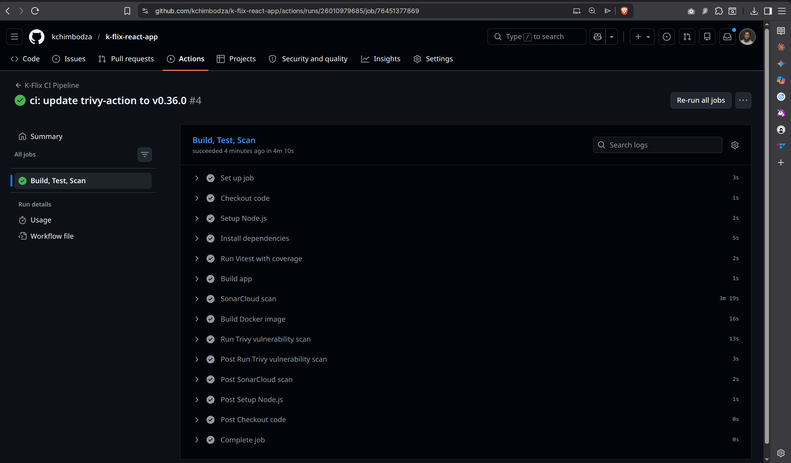

### Vitest — Tests Passing
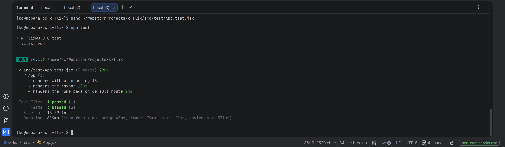

### SonarCloud — Quality Gate Passed
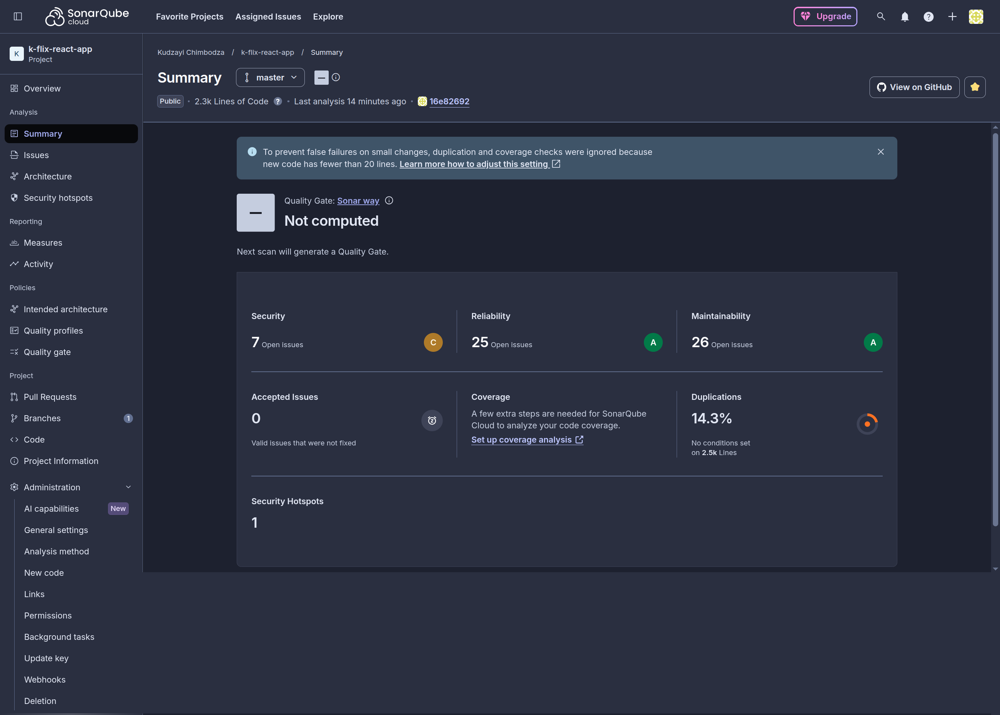

### Docker Image Pushed to ECR
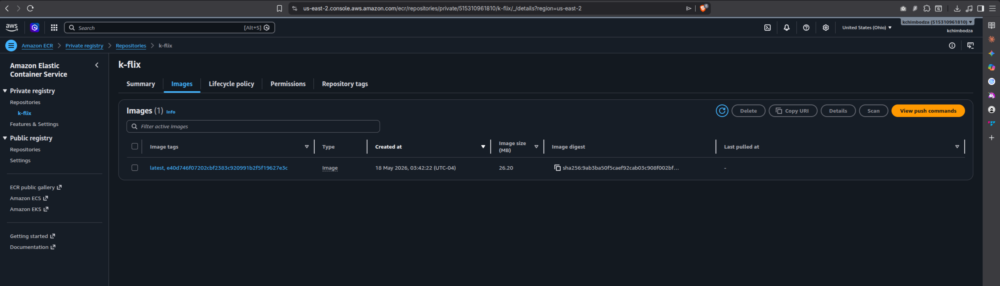

### Terraform Plan — 52 Resources
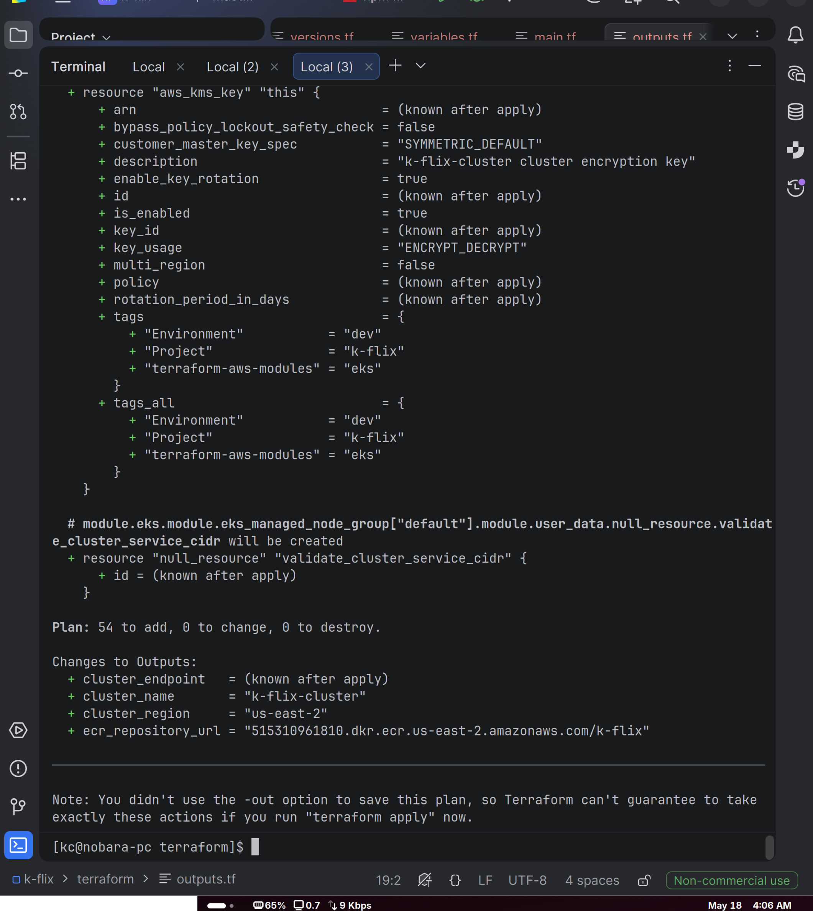

### EKS Cluster Live
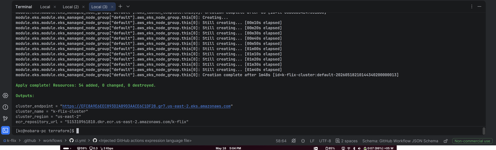

### ArgoCD — Synced & Healthy
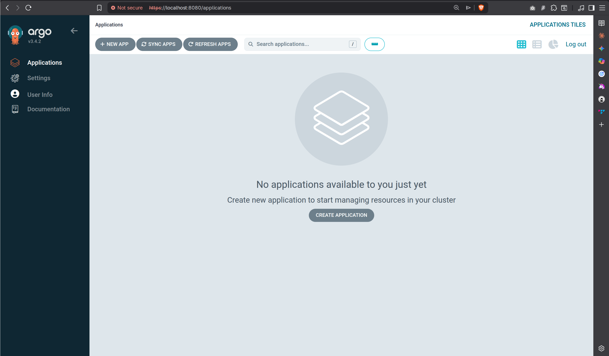

### ArgoCD Deployment Tree
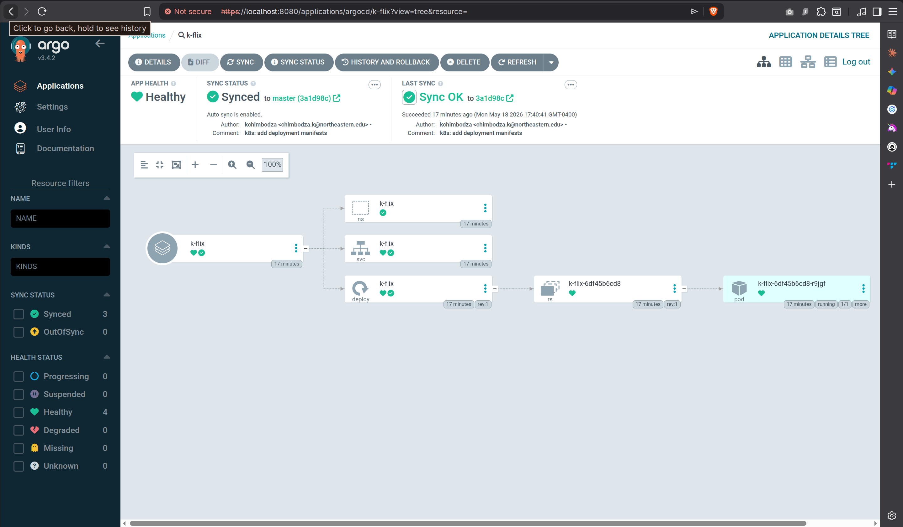

### K-Flix Live on EKS


### App Working — Login & Watchlist
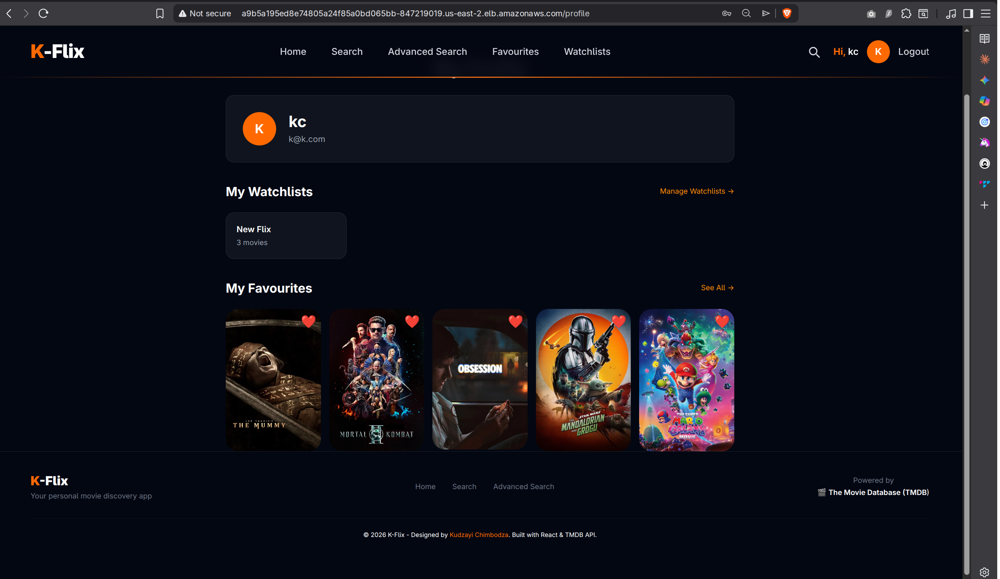

### Grafana — Kubernetes Metrics Dashboard
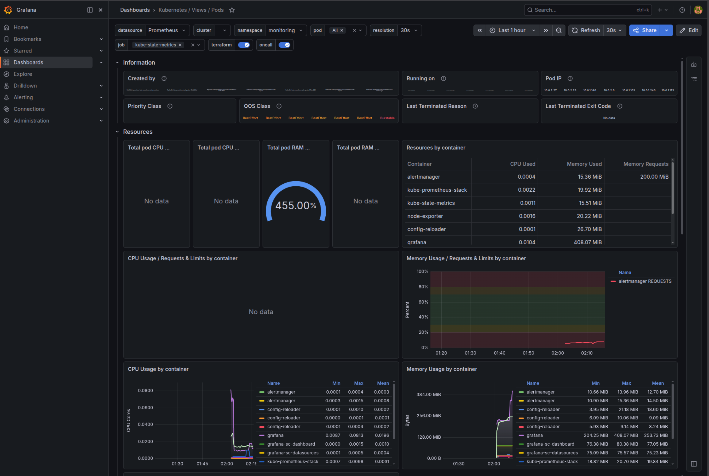

### Slack — Alerts Firing
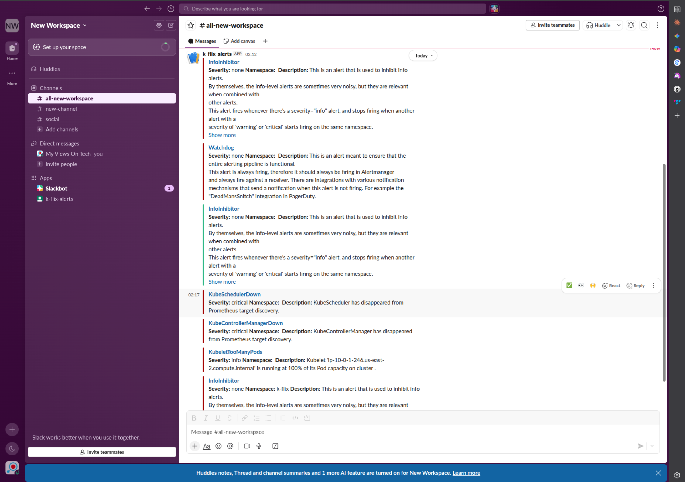

### Self-Healing — Pod Deleted and Rescheduled
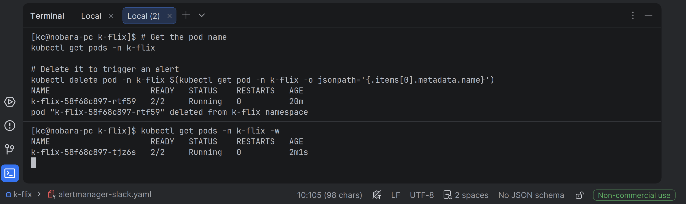

---

## Author

**Kudzayi Chimbodza**  
MSc Cyber-Physical Systems (IoT), Northeastern University Toronto  
[github.com/kchimbodza](https://github.com/kchimbodza) · [myviewsontech.com](https://myviewsontech.com)
